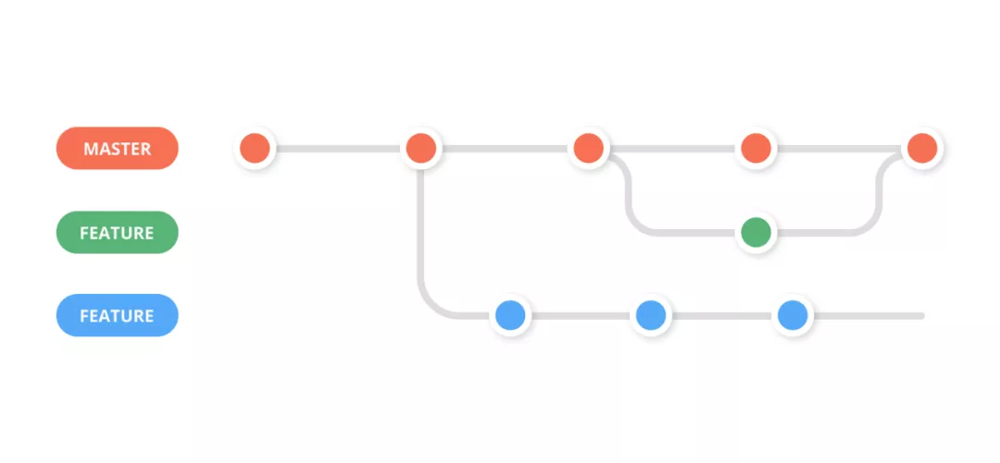

# Minishell | 42Vienna

This repository contains the source code for MiniShell, a minimalistic shell interpreter built from scratch. The project is designed to mimic the functionality of traditional Unix shells in a simplified manner, providing a lightweight and easy-to-understand alternative for learning and teaching purposes.

Features
Basic command execution: MiniShell can execute basic commands that are found in the PATH.
Environment variable handling: MiniShell supports the use of environment variables in commands.
Command chaining: Commands can be chained using logical operators (&& and ||).
Redirections: MiniShell supports input and output redirections (<, >, >>).
Pipes: Commands can be piped using the | operator.
Subshells: Commands can be grouped and executed in subshells using parentheses (()).
Here documents: MiniShell supports here documents (<<).

## Expander

...

#### TODO

- [ ] Handle these cases...

```sh
lyeh@c1r1p5:~/project/curriculum/minishell/data$ export a="file name"
lyeh@c1r1p5:~/project/curriculum/minishell/data$ < $a
bash: $a: ambiguous redirect
lyeh@c1r1p5:~/project/curriculum/minishell/data$ export a="ls -l"
lyeh@c1r1p5:~/project/curriculum/minishell/data$ $a
total 56
drwxr-xr-x 2 lyeh 2022_vienna  4096 Dec  9 17:36 images
-rw-r--r-- 1 lyeh 2022_vienna 43623 Dec  9 18:41 parseing_rule.tab.c
-rw-r--r-- 1 lyeh 2022_vienna  2405 Dec  9 18:41 parseing_rule.tab.h
-rw-r--r-- 1 lyeh 2022_vienna  1457 Dec  9 18:39 parseing_rule.y
lyeh@c1r1p5:~/project/curriculum/minishell/data$ << eof
> eof
lyeh@c1r1p5:~/project/curriculum/minishell/data$ << $USER
> USER
> $USER
lyeh@c1r1p5:~/project/curriculum/minishell/data$ echo $'USER'
USER
lyeh@c1r1p5:~/project/curriculum/minishell/data$ << $'USER'
> $USER
> USER

```

## Collaborations

### Git Workflow

We choose `Feature Branching Git Workflow` as our cowork flow in the project.



#### Step 0.

Checkout to main branch to pull the latest update.

```
> git checkout main
> git pull
```

#### Step 1.

Create new feature branch for each feature, the feature develop life cycle should be around hours work.

```
> git checkout -b feat-<NAME>
```

#### Step 2.

After your work, checkout back to the main branch and align with the latest version again. Then checkout to feature branch and rebase with main branch.

```
> git checkout main
> git pull

> git checkout feat-<NAME>
> git rebase main
```

#### Step 2.a

No confiliction happend! Go to the Step 3.

#### Step 2.b

Occur confiliction when rebase...

1. First, git will pause the rebase and allow you to fix the conflict. You can see which files contain conflicts by running git status.

2. Open the file with conflicts. Git marks conflicts in the source code with <<<<<<<, =======, and >>>>>>>. The code between <<<<<<< and ======= is your local changes and the code between ======= and >>>>>>> is the incoming changes. You need to manually edit the file to resolve the conflict.

3. After you've resolved the conflict, you need to add the resolved files to the staging area and continue the rebase process.

```
> git add <filename>
> git rebase --continue
```

#### Step 3

Push the feature branch to the remote repository branch 
PS: Because we use `rebase` to change the history, so it's necessary force push.

```
> git push origin feat-<NAME> --force
```

#### Step 4

Make a pull request and wait for the review and merge by your pear.
