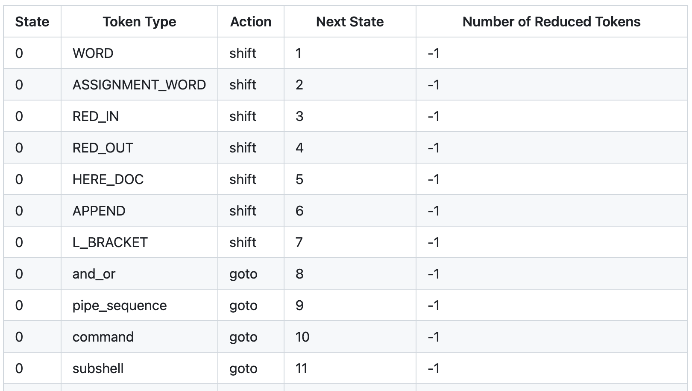
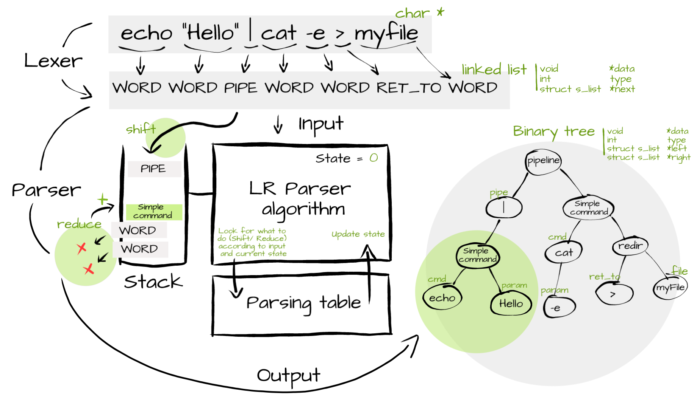
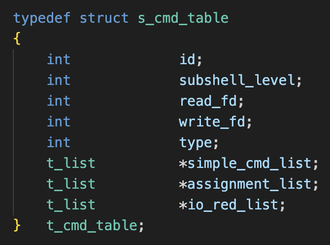
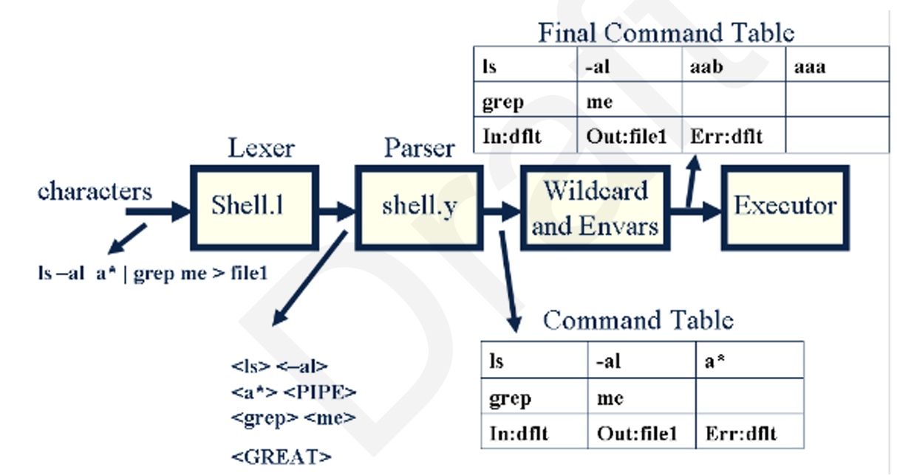
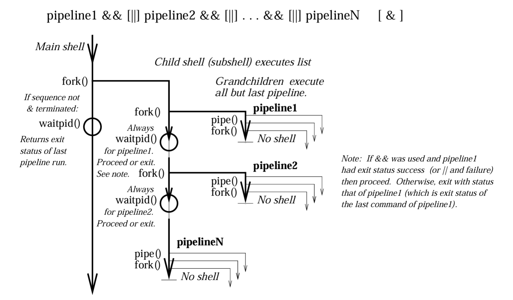

<div align="center">

You can find more [notes and drawings](https://github.com/LeaYeh/minishell/tree/notes-git_lfs_required/doc/notes) on this branch.<br>
Because of the large file sizes of these notes, this branch uses `git-lfs`.<br>
To switch to this branch locally you need to install [**git-lfs**](https://git-lfs.com).

---

# <i>🌊</i>rash Minishell | @42Vienna
### The Creative Abort Shell

<br>

[](https://github.com/LeaYeh/minishell/actions/workflows/test.yaml?query=branch%3Amain)
[](https://github.com/LeaYeh/minishell/actions/workflows/norminette.yaml?query=branch%3Amain)
[](https://github.com/LeaYeh/minishell/releases)
[](https://github.com/LeaYeh/minishell/tags)

[](https://github.com/LeaYeh/minishell)
[](https://github.com/LeaYeh/minishell/actions/workflows/lines_of_code.yaml)
[](https://github.com/LeaYeh/minishell/blob/main/LICENSE)

<br>

This project goes beyond merely crafting a new shell from scratch; it endeavors to emulate the Bash source code and the GNU Bash POSIX manual while incorporating principles from compiler parsing. By referencing these authoritative sources, the project aims to meticulously implement a shell interpreter. Moreover, it documents the entire journey from ground zero to the creation of a personalized shell, serving as a valuable resource for future learners seeking insights into shell development.


</div>

---

# Table of Contents

* [Support Features](#support-features)
* [DevOPS Spirit](#devops-spirit)
    * [Embrace Development Consistency with Docker](#embrace-development-consistency-with-docker)
    * [How to Re-use Our CI/CD Framework For Your Own Minishell](#how-to-re-use-our-cicd-framework-for-your-own-minishell)
    * Basic cowork flow and git command
* [Things Before the Implementation](#things-before-the-implementation)
    * [Why We Need to Follow the Bash POSIX](#why-we-need-to-follow-the-bash-posix)
    * [How to Avoid Corner Cases Hell at Beginning](#how-to-avoid-corner-cases-hell-at-beginning)
* [Implementations](#implementations)
    * [Frontend](#frontend)
        * [Lexer](#lexer)
            * [Support `Token` Types](#support-token-types)
        * [Parser](#parser)
            * [Why We Choose `Shift-Reduced` as Parsing Algorithm](#why-we-choose-shift-reduced-as-parsing-algorithm)
            * [How `Shift-Reduced` Algorithm Works](#how-shift-reduced-algorithm-works)
            * [Do I Really Need a AST tree or Command Table List](#do-i-really-need-a-ast-tree-or-command-table-list)
            * [How to Design the Grammar in Your Shell](#how-to-design-the-grammar-in-your-shell)
            * [How to Generate Parsing Table](#how-to-generate-parsing-table)
    * [Backend](#backend)
        * [Executor](#executor)
            * [How We Design Our Subprocess Flow](#how-we-design-our-subprocess-flow)
            * [What Is Subshell](#what-is-subshell)
            * [What Is The Different Between Builtins and External Command](#what-is-the-different-between-builtins-and-external-command)
        * Redirection
    * [Cross-end](#cross-end)
        * Expander
        * [Signal](#signal)
            * [Signal Handling](#signal-handling)
            * [Exception Handling](#exception-handling)
            * [Known Issue](#known-issue)
* [How to test with Valgrind](#how-to-test-with-valgrind)

# Support Features

| Category   | Module      | Function               | Requirement                                                                                              | Status |
|------------|-------------|------------------------|----------------------------------------------------------------------------------------------------------|--------|
| Frontend   | Lexer       | Tokenizing             | Tokenize user input into token list.                                                                     | ✅     |
|            |             |                        | Support `PIPE` `\|`.                                                                                     | ✅     |
|            |             |                        | Support logical `AND` `&&`.                                                                              | ✅     |
|            |             |                        | Support logical `OR` `\|\|`.                                                                             | ✅     |
|            |             |                        | Support sequential operator `;`.                                                                         | 🛇     |
|            |             |                        | Support left and right parentheses `()` for `SUBSHELL`.                                                  | ✅     |
|            |             |                        | Support `WORD` representing basic words.                                                                 | ✅     |
|            |             |                        | Recognize `ASSIGNMENT_WORD` `=` for local variable assignments.                                          | ✅     |
| Frontend   | Parser      | Syntax Analysis        | Analyze syntax of token list and report syntax errors based on Shift-Reduce algorithm with predefined grammar rules and then output as command table list. | ✅     |
| Frontend   | Expander    | Brace Expansion        | Perform brace expansion to generate multiple strings based on expressions enclosed in braces `{}`.       | 🛇     |
|            |             | Tilde Expansion        | Perform tilde expansion to replace `~` with the current user's home directory path.                      | 🛇     |
|            |             | Parameter Expansion    | Perform parameter expansion to replace variables and special parameters (optionally enclosed in braces `{}`) in a string. | ✅     |
|            |             | Command Substitution   | Perform command substitution to replace command output in a string.                                      | 🛇     |
|            |             | Arithmetic Expansion   | Perform arithmetic expansion to evaluate mathematical expressions enclosed in `$(())`.                   | 🛇     |
|            |             | Process Substitution   | Perform process substitution to use the output of a command as a file or input to another command.       | 🛇     |
|            |             | Word Splitting         | Perform word splitting to split a string into separate words based on spaces, tabs, and newlines.        | ✅     |
|            |             | Wildcard Expansion     | Perform filename expansion (globbing) in the current directory to generate filenames matching a specified pattern. | ✅     |
|            |             | Quote Removal          | Remove quotes from strings to interpret them as literal values.                                          | ✅     |
| Backend    | Builtins    | cd                     | Implement `cd` with relative and absolute paths.                                                         | ✅     |
|            |             | echo                   | Implement `echo` with option `-n`.                                                                       | ✅     |
|            |             | env                    | Implement `env` with no options or arguments.                                                            | ✅     |
|            |             | exit                   | Implement `exit` with no options.                                                                        | ✅     |
|            |             | export                 | Implement `export` with no options.                                                                      | ✅     |
|            |             | pwd                    | Implement `pwd` with no options.                                                                         | ✅     |
|            |             | unset                  | Implement `unset` with no options.                                                                       | ✅     |
| Backend    | Redirection | IO Redirection         | Redirect `STDIN` with input redirection by `<` operator.                                                 | ✅     |
|            |             |                        | Redirect `HEREDOC` with input redirection by `<<` operator.                                              | ✅     |
|            |             |                        | Redirect `STDOUT` with output redirection by `>` operator.                                               | ✅     |
|            |             |                        | Redirect `STDOUT` append with output redirection by `>>` operator.                                       | ✅     |
|            |             | Subshell Redirection   | Implement redirections and pipes between subshell groups (`\|`).                                         | ✅     |
|            |             | Pipe Redirection       | Redirect `STDIN`/`STDOUT` by `pipe()`.                                                                   | ✅     |
| Backend    | Assignment  | Local Assignment       | Assign variables local to the current shell environment or for the duration of a command following the assignment. | 🛇     |
| Cross-end  | Signals     | Signal Handling        | Handle `ctrl-C` as `SIGINT` mirroring bash's behavior.                                                   | ✅     |
|            |             |                        | Handle `ctrl-D` as `EOF` mirroring bash's behavior.                                                      | ✅     |
|            |             |                        | Handle `ctrl-\\` as `SIGQUIT` mirroring bash's behavior.                                                 | ✅     |
|            |             | Exception Handling     | Handle `SIGPIPE` in internal process and set it back to default in external command sub-processes.       | ✅     |
|            |             |                        | Use `SIGUSR1` and `SIGTERM` to raise internal critical error to all related processes and handle it depending on scenario. | ✅     |


# DevOPS Spirit

## Embrace Development Consistency with Docker

Our [42-Docker-DevEnv](https://github.com/LeaYeh/42-Docker-DevEnv) project ensures a consistent development experience across all devices by seamlessly integrating with VSCode. This setup offers the best of both worlds: the portability and uniformity of Docker, combined with the rich features of VSCode, allowing you to start coding efficiently with minimal setup, anywhere.

## How to Re-use Our CI/CD Framework For Your Own Minishell

### Introduction

Our CI/CD framework integrates [42_minishell_tester](https://github.com/LeaYeh/42_minishell_tester), significantly enhancing our testing capability by adding an extensive set of test cases. This not only expanded our test coverage but also accelerated the testing process by 3x, slashing the time from 15 minutes to just 5 minutes. By adopting this framework, your Minishell project can benefit from a more robust and efficient development workflow.


### Installation

0. Pre-requirement

Handle the non-interactive mode readline for the tester
> https://github.com/LeaYeh/42_minishell_tester?tab=readme-ov-file#setup

Reference: https://github.com/zstenger93/42_minishell_tester


1. Download our GitHub Action setting `.github` into your project folder

```sh
curl -L -o github.tar.gz https://github.com/LeaYeh/minishell/archive/main/github.tar.gz && \
tar -xzvf github.tar.gz --strip-components=1 "minishell-main/.github" && \
rm -rf github.tar.gz
```

2. Commit and push GitHub Action setting into the remote stream

```sh
git add .github
git commit -m "feat: Init ci/cd framework for minishell"
git push
```

3. Config the repository setting

<details>
<summary>Find settings of the repository
</summary>


</details>

<details>
<summary>Config the setting of your main branch
</summary>


</details>

<details>
<summary>Config the permissions of GitHub Action
</summary>


</details>

## Basic Cowork Flow and Git Command

### Git Workflow

We choose `Feature Branching Git Workflow` as our cowork flow in the project.


#### Step 0.

Checkout to main branch to pull the latest update.

```
> git checkout main
> git pull
```

#### Step 1.

Create new feature branch for each feature, the feature develop life cycle should be around hours work.

```
> git checkout -b feat-<NAME>
```

#### Step 2.

After your work, checkout back to the main branch and align with the latest version again. Then checkout to feature branch and rebase with main branch.

```
> git checkout main
> git pull

> git checkout feat-<NAME>
> git rebase main
```

#### Step 2.a

No confiliction happend! Go to the Step 3.

#### Step 2.b

Occur confiliction when rebase...

1. First, git will pause the rebase and allow you to fix the conflict. You can see which files contain conflicts by running git status.

2. Open the file with conflicts. Git marks conflicts in the source code with <<<<<<<, =======, and >>>>>>>. The code between <<<<<<< and ======= is your local changes and the code between ======= and >>>>>>> is the incoming changes. You need to manually edit the file to resolve the conflict.

3. After you've resolved the conflict, you need to add the resolved files to the staging area and continue the rebase process.

```
> git add <filename>
> git rebase --continue
```

#### Step 3

Push the feature branch to the remote repository branch
PS: Because we use `rebase` to change the history, so it's necessary force push.

```
> git push origin feat-<NAME> --force
```

#### Step 4

Make a pull request and wait for the review and merge by your pear.

### Shared Google Doc

[Link](https://docs.google.com/document/d/1zbVAnrPLIJIaJ28Th6ddv0U3SJ_CSCF7k0x34StQpSE/edit)

# Things Before the Implementation

## Why We Need to Follow the Bash POSIX

POSIX (Portable Operating System Interface).
Adhering to POSIX standards is highly beneficial for shell development, particularly if you aim for your code to run across different operating systems and receive widespread support. POSIX provides a common baseline, ensuring consistent behavior, portability, and reliability across diverse environments.

## How to Avoid Corner Cases Hell at Beginning

When first getting started with Bash, it's common to find many corner cases in behavior that are hard to understand. Without understanding the underlying workflow of Bash before starting implementation, you may end up hard-coding solutions for numerous corner cases, which can indirectly lead to a plethora of bugs. This can make later stages of development extremely painful.

These chapters provide detailed definitions of the flow for each module. By following this flow, you can ensure consistency with Bash behavior.

- 3.5 Shell Expansions
    - 3.5.3 Shell Parameter Expansion
    - 3.5.7 Word Splitting
    - 3.5.8 Filename Expansion
    - 3.5.8.1 Pattern Matching
    - 3.5.9 Quote Removal
- 3.6 Redirections
    - 3.6.1 Redirecting Input
    - 3.6.2 Redirecting Output
    - 3.6.3 Appending Redirected Output
    - 3.6.4 Redirecting Standard Output and Standard Error
    - 3.6.5 Appending Standard Output and Standard Error
    - 3.6.6 Here Documents
- 3.7 Executing Commands
    - 3.7.1 Simple Command Expansion
    - 3.7.2 Command Search and Execution
    - 3.7.3 Command Execution Environment
    - 3.7.4 Environment
    - 3.7.5 Exit Status
    - 3.7.6 Signals

Reference: [Bash Manual](https://www.gnu.org/software/bash/manual/html_node/index.html) Is All You Need

# Implementations

## Frontend

### Lexer

Tokenizes the user input `command string` into a `tokens list`.

> In the Lexer module, we solely perform tokenization without any syntax checking.

#### Support `Token` Types

In addition to the mandatory parts, in this project, we implemented all functionalities of subshell and AND OR operators as per the Bash POSIX manual.

* `END`: This token type represents the end of the input string or the end of a command. It indicates that there are no more tokens to process.
* `NONE`: This token type is used to signify an undefined or invalid token. It may indicate an error in the lexer or parser.
* `WORD`: This token type is used for general words in the command, such as command names, arguments, or parameters. It encompasses alphanumeric characters and some special characters.
* `ASSIGNMENT_WORD`: This token type is used for assignment words, which typically occur in variable assignments. For example, in the command VAR=value, VAR is an assignment word.
* `RED_IN`: This token type represents input redirection, indicating that the command should read input from a file specified in the command.
* `RED_OUT`: This token type represents output redirection, indicating that the command should write output to a file specified in the command.
* `PIPE`: This token type represents a pipe, which is used to redirect the output of one command as input to another command.
* `HERE_DOC`: This token type represents a "here document" redirection, which allows providing input to a command inline within the script or command.
* `APPEND`: This token type represents append redirection, indicating that the output should be appended to a file rather than overwriting it.
* `OR`: This token type represents the logical OR operator, typically used in conditional statements or command chaining.
* `AND`: This token type represents the logical AND operator, also used in conditional statements or command chaining.
* `L_PAREN`: This token type represents a left parenthesis, which may be used to denote the start of a group or condition in certain contexts.
* `R_PAREN`: This token type represents a right parenthesis, used to denote the end of a group or condition in corresponding contexts.

### Parser

Analyzes the token list generated by the Lexer, identifies syntax errors, and produces either an Abstract Syntax Tree (AST) or a list of command tables as output.

> In the parser stage, **we deliberately avoid performing any expansion**. This decision is made to prevent incorrect behavior that may arise due to expansion at this stage. Expansion involves processes such as variable expansion, command substitution, arithmetic expansion, and pathname expansion, which can significantly alter the structure of the input command. Performing expansion at this early stage could lead to misinterpretation of the command's structure, potentially resulting in errors or unexpected behavior during parsing and subsequent execution. Therefore, expansion is deferred to later stages in the shell processing pipeline where it can be executed accurately within the appropriate context.

#### Why We Choose `Shift-Reduced` as Parsing Algorithm?

In our custom parser, we have opted to use the shift-reduce parsing algorithm. We believe this choice provides an excellent opportunity to delve into compiler frontend development. This algorithm is widely applicable in implementing frontends for various programming languages. One of the advantages of using the shift-reduce algorithm is that it avoids handling syntax error cases individually. When the parsing table cannot find a corresponding action for the current state and symbol, it signifies an error message. This approach not only simplifies the implementation process but also helps in understanding how compilers handle syntax parsing efficiently.

Moreover, by implementing a shift-reduce parser, we gain insights into fundamental concepts such as tokenization, grammar rules, parsing tables, and error handling mechanisms. This knowledge can be applied not only to shell scripting but also to the development of compilers for other languages. Through this project, we aim to provide a hands-on learning experience in compiler frontend development, fostering a deeper understanding of language processing techniques.

#### How `Shift-Reduced` Algorithm Works?

The shift-reduce parsing algorithm is a type of bottom-up parsing technique commonly used in the development of compiler frontends. It operates by shifting input tokens onto a stack until a reduction rule can be applied. Here's how it works:
* Input Tokens: The algorithm starts with a sequence of input tokens to be parsed, typically generated by the lexer.
* State/Paser Stack: It maintains a stack to keep track of the tokens and partial parse trees during the parsing process.
    - `state_stack`: This stack keeps track of the current state. When the algorithm completes the corresponding action and pops out elements, it pushes the next state based on the parsing table.
    - `parse_stack`: This stack temporarily stores shifted tokens and is used for reduce operations to generate corresponding AST nodes.
* Shift Operation: During the shift operation, the algorithm takes the next token from the input sequence and pushes it onto the stack. This process continues until a reduction can be applied.
* Reduce Operation: When a reduction is possible, the algorithm applies a production rule to a portion of the stack. This involves popping a set of tokens from the stack and replacing them with a non-terminal symbol that represents a higher-level construct in the grammar.
* Parsing Table: The decision to shift or reduce is guided by a parsing table constructed based on the grammar rules of the language. This table determines the action to be taken based on the current state of the stack and the next input token.
* Error Handling: If the parsing table cannot find a valid action for the current state and input token, it indicates a syntax error, and the parser may attempt error recovery strategies such as discarding tokens or inserting missing tokens to continue parsing.
* Accept: The parsing process continues until the entire input sequence is processed, and the stack contains a single parse tree representing the input according to the grammar rules.
* Output: Finally, the parser may generate an abstract syntax tree (AST) or perform additional semantic analysis based on the parse tree to further process the input.

Overall, the shift-reduce parsing algorithm efficiently constructs a parse tree by iteratively shifting input tokens onto a stack and applying reduction rules based on the grammar of the language. It's widely used due to its simplicity and effectiveness in parsing context-free grammars.

Base on the parsing table, it list all combination of all user input in the table. When looks up the table,
1. Check the top state on the `state_stack` with `STATE`
2. Check the input `TOKEN_TYPE` with the current token list node
    - If match, do shift
    - If not match but `default` exist, do `reduce` then pop out current `STATE` on `state_stack` and the correspond numbers of node in `parser_stack`. And then do `goto` and push `NEXT_STATE` onto `state_stack`
    - If not match or can not find correspnd `pt_entry` in the parsing table, report current token as symtax error.

Part of our parsing table:


Reference: https://github.com/twagger/minishell



#### Do I Really Need a AST tree or Command Table List?

`AST tree`:
An Abstract Syntax Tree (AST) is useful for representing the hierarchical structure of a program or command, aiding in semantic analysis, optimization, and code generation.

`Command Table List`:
A Command Table List organizes parsed commands for execution, simplifying processing and facilitating error checking and debugging.

If you don't need to implement subshell functionality, the structure of a Command Table List is sufficient for your requirements. However, if handling hierarchical information is necessary, choosing an AST can significantly reduce complexity. We regret opting for a Command Table List, as it made our subprocess flow design less elegant.



Reference: https://www.cs.purdue.edu/homes/grr/SystemsProgrammingBook/Book/Chapter5-WritingYourOwnShell.pdf


##### How to Design the Grammar in Your Shell

To design the grammar for your shell, you can reference the [official shell grammar](https://pubs.opengroup.org/onlinepubs/009604499/utilities/xcu_chap02.html) provided by Bash and tailor it to support the features you need by making modifications and reductions.

You can use this grammar as a reference point and streamline it based on the functionalities you want to support in your shell. This process involves analyzing the features you need and simplifying or removing elements from the grammar that are not relevant to your specific requirements.

##### How to Generate Parsing Table

Pre-requirement: GNU M4 1.4 and bison, [check here](https://chat.openai.com/share/06ff7af8-0ab0-477e-a2e9-aa095199a704).

1. Design parsing rule, look more detail in our [parsing rule](meta/parsing_rule.bnf).
2. Use `bison` tool to generate parsing table by the rules, and check your output `<PARSING_RULES>`.output

```
> bison -v <PARSING_RULES>.y
```

> check our parsing rules [here](meta/parsing%20rules/index.md) (ref: [online BNF generator](https://www.bottlecaps.de/rr/ui))

> use online tool to check input command parsing tree with BNF [here](http://lab.antlr.org/).

3. Convert [parsing table](meta/parsing_rule.output) for `Shift-Reduce` algorithm.
    - We have implemented a [simple converter](meta/gen_action_table.py) in Python to transform `parsing_rule.output` into a table suitable for referencing in code.

## Backend

### Executor

The biggest challenge lies in designing the subprocess flow. A well-designed flow can facilitate easier and more reasonable handling of exit codes. If you opt to implement the subshell feature, it's crucial to ensure that the subprocess flow architecture is robust enough, as it's not feasible to handle all corner cases through hard coding. Choosing to generate an AST tree in the Parser can make handling easier.

#### How We Design Our Subprocess Flow

When designing the subprocess flow in the executor module, we referred to the hierarchical relationships of various elements in the BNF grammar. We considered that even in the case of any error occurring in any subprocess, it needs to be handled properly, and there should be control over whether the minishell exits. We also observed the behavior of Bash by examining its source code and mimicked the subprocess flow design at the Bash's underlying level.

Therefore, we devised a hierarchical subprocess flow akin to a layered cake. Below, I will illustrate our design philosophy with examples.

>
> In the process flow diagram:
> 1. [P|S|C]n
>   - P: represents a pipeline
>   - S: represents a subshell
>   - C: represents a simple command
>   - n: represents the process ID but has no sequential significance
> 2. Solid line: represents a forked process
> 3. Dotted line: represents a non-forked built-in function
> 4. Horizontal dotted line after a forked process: represents `waitpid()` for process synchronization.

##### Example 1:
```sh
> (export A=123) && echo $A

Output:

```
In this example, when `(export A=123) && echo $A` is executed, the output appears to be blank. Let's break down the subprocess flow and the reasons behind why echo `$A` results in null output.

Subprocess Flow:

The command `(export A=123)` is a subshell, denoted by the parentheses `( )`. Subshells are executed in a separate process.
Within the subshell, `export A=123` sets the environment variable `A` to `123`.
The `&&` operator ensures that the subsequent command (`echo $A`) is executed only if the preceding command (`(export A=123)`) succeeds.

Reasons for Null Output:

The export command only affects the environment within the current shell or subprocess. It does not propagate changes back to the parent shell.
After the subshell `(export A=123) `completes, the environment variable `A` is set within that subshell's environment.
However, when the subsequent command echo `$A` is executed, it is in a different subprocess or shell, and it does not inherit the environment variable `A` set within the previous subshell.
Consequently, `$A` in `echo $A` evaluates to null because the variable `A` is not defined in the current subprocess's environment.

Builtins Function:

`export` is a builtin command in most shells, including Bash. It is used to set an environment variable in the current shell and make it available to subprocesses.
However, in the given scenario, the `export` command is used within a subshell `( )`. While it sets the variable A within the subshell, it does not propagate this change to the parent shell.
Therefore, due to the isolation of subprocess environments and the absence of variable propagation between them, `echo $A` results in `null` output in this example.


##### Example 2:
```sh
> yes | (cat < /dev/urandom| head -1 && (head -1 | head -1)) | cat

Output:
d>�!�#?-��O�Y>�Le0/�����٪sGV�q��.�ţ�
y
```

In this example, the command involves multiple pipelines and subshells, with pipe input redirection bound within the subshell and pipe output redirection sequentially bound to `cat` within the subshell.

Execution Flow:

The command involves several nested subshells and pipelines, each processing data in succession.
The outermost subshell `( ... )` encapsulates the entire command sequence.
Within this subshell, multiple pipelines are executed in sequence, separated by the `|` operator.

Pipe Input Redirection:

Pipe input redirection `< /dev/urandom` redirects the output of `/dev/urandom` to `cat`, effectively providing an infinite stream of random data to the pipeline.
Sequential Binding of Redirections:

Within the subshell, each pipeline's output is sequentially bound to the input of the next command using pipe output redirection `|`.

Execution Result:

The command yes generates an infinite stream of the string "y".
`cat < /dev/urandom | head -1` reads random data from `/dev/urandom` and outputs the first line.
`(cat < /dev/urandom | head -1 && (head -1 | head -1)) `represents a nested subshell where the output of the first pipeline is concatenated with the output of `head -1 | head -1`.
The output of this subshell is then piped into cat which outputs the concatenated result.
Due to the randomness of `/dev/urandom` and the processing of `head -1` commands, the output appears as a mixture of random characters, likely due to character encoding mismatches and non-printable characters.

Reason for Output:

The output consists of random characters generated by `/dev/urandom`, with the processing of `head -1` and concatenation operations contributing to the final output.
Therefore, the observed output is a result of processing random data from `/dev/urandom`, combined with the behavior of `head -1` and concatenation operations within the nested subshell.


Reference: https://www.cs.uleth.ca/~holzmann/C/system/shell_does_pipeline.pdf


Part of BNF grammar:
```bnf
pipe_sequence	: command | pipe_sequence PIPE command;
command         : simple_command | subshell | subshell redirect_list;
subshell        : L_PAREN and_or R_PAREN;
simple_command	: cmd_prefix cmd_word cmd_suffix | cmd_prefix cmd_word | cmd_prefix | cmd_name cmd_suffix | cmd_name;
```

#### What Is Subshell

Subshell is a child instance of the main shell process. When a subshell is created, it inherits the environment and variables of the parent shell but operates independently. Subshells are commonly used to execute commands or scripts within a separate context without affecting the parent shell.

```sh
> (export A=123 && echo $A) && $A

Output:
123

```

```sh
> pwd && (cd source/) && pwd

Output:
/Users/leayeh/project/git_dev/42/curriculum/minishell
/Users/leayeh/project/git_dev/42/curriculum/minishell

> pwd && cd source/ && pwd

Output:
/Users/leayeh/project/git_dev/42/curriculum/minishell
/Users/leayeh/project/git_dev/42/curriculum/minishell/source

```

#### What Is The Different Between Builtins and External Command

The main differences between builtins and external commands in Bash lie in their implementation, execution performance, and access to shell internals. Builtins are integrated directly into the shell, execute faster, and have access to shell internals, while external commands are standalone executables requiring process forking and operate independently of the shell environment.

* Builtins
    - They are directly implemented within the shell, so executing them does not require forking a separate process.
    - Builtins typically offer performance advantages over external commands because they execute faster due to not needing to spawn a new process.
    - Builtins have direct access to the shell internals, which allows them to manipulate the shell's environment and variables more efficiently.
    - Examples of builtins include cd, echo, pwd, and export.
* External Commands
    - External commands are standalone executable files located in directories listed in the PATH environment variable.
    - When you execute an external command, Bash must fork off a separate process to run the command.

Reference: https://tldp.org/LDP/abs/html/internal.html

### Redirection

## Cross-end

### Expander

### Signal

#### Signal Handling

1. Interactive and Non-interactive Modes:
    - The function (`fork_pipeline`) is responsible for creating a child process to execute pipeline commands. In this function, we consider the differences in signal handling between interactive and non-interactive modes.
    - In interactive mode, users can directly interact with the program, while in non-interactive mode, the program typically executes as a script or reads commands from a file.
    - Our design needs to account for the behavioral differences in signal handling between these two modes. In interactive mode, we need to capture some common signals, such as `SIGINT` (`Ctrl+C`), to allow users to interrupt executing commands. In non-interactive mode, we still need to ensure the handling of signals sent by the system to ensure the program's stable operation.
2. Relationship between Subprocesses, fork, and Subshells:
    - When executing pipeline commands, we use the `fork()` function to create a child process. Child processes usually inherit the signal handling settings of the parent process but can also override them by setting their own signal handling methods.
    - Signal handling in the child process may differ from that in the parent process, depending on whether signal handling is reset after the child process is created.
    - Additionally, we set different signal handling methods in the parent and child processes to ensure proper signal handling while executing pipeline commands. For instance, in the child process, we ignore the `SIGINT` signal to avoid interrupting executing commands, while in the parent process, we record the `SIGINT` signal for subsequent handling.
3. Resetting Signal Handlers for External Commands:
    - Before executing an external command (`handle_external_cmd`), we reset the signal handlers to their default settings (`SIG_DEFAULT`). This ensures that the external command can handle signals according to its own logic without interference from the shell's signal handling.
    - By resetting the signal handlers, we allow the external command to have complete control over how it handles signals, providing flexibility and adherence to Unix signal handling conventions.
4. Handling SIGPIPE Signal for Builtin Commands:
    - For builtin commands (`handle_builtin`), especially those involved in pipeline operations, we decided to handle the `SIGPIPE` signal ourselves to stay consistent with the 42 practice of no resource _leaks_ at exit.
    - We set up the signal handler to catch the `SIGPIPE` signal. This prevents the shell from terminating immediately if a builtin command attempts to write to a broken pipeline, which would be the default behavior of a `SIGPIPE` signal. Instead, the shell frees all its resources manually and then exits cleanly.

#### Exception Handling

Using signals for exception handling in shell programming, similar to Bash's design, serves several purposes. Let's examine why signals are employed in our source code to handle critical errors like memory allocation failures, fork failures, or other creation failures, and how they enable us to respond appropriately to such exceptions:

1. Prompt Response to Critical Errors:
    - When critical errors occur, such as memory allocation failures (`MALLOC_ERROR`) or fork failures (`FORK_ERROR`), it's essential to respond promptly to mitigate any adverse effects.
    - By utilizing signals, we can promptly broadcast error messages and take appropriate actions, such as terminating subprocesses or halting execution, depending on the severity of the error.
2. Ensuring Subprocess Termination:
    - In the event of a critical error, it's crucial to ensure that all subprocesses spawned by the shell are terminated to prevent any lingering processes that could potentially cause issues or consume resources.
    - Signals like `SIGUSR1` and `SIGTERM` are used to terminate subprocesses gracefully, ensuring that they clean up resources and exit properly.
3. Providing Feedback to Users:
    - Exception handling using signals allows us to provide feedback to users about the occurrence of critical errors. We can print error messages, indicating the nature of the error and any relevant details, enhancing user understanding and troubleshooting.
4. Facilitating Controlled Shutdown:
    - In situations where critical errors occur, it's essential to have mechanisms in place to facilitate a controlled shutdown of the shell environment. Signals help initiate a controlled exit, allowing the shell to clean up resources, release memory, and exit gracefully.

Let's take a closer look at how signals are utilized in our source code:

- `raise_error_and_escape`: This function raises an error message and initiates an abort signal (`SIGUSR1`) to terminate all subprocesses. It's used for critical errors where immediate termination is necessary.
- `raise_error_to_all_subprocess`: Similar to the previous function, this one raises an error message and sends a termination signal (`SIGTERM`) to all subprocesses. It's used when the error is critical but allows for a graceful shutdown.
- `raise_error_to_own_subprocess` and `signal_to_all_subprocess`: These functions are used for handling errors within subprocesses. They ensure that subprocesses receive termination signals (`SIGTERM`) and facilitate controlled shutdowns.

#### Known Issue

In our signal handler, there exists a non-reentrant issue, which could lead to significant consequences.

**Reasons for the non-reentrant issue:**

The fundamental cause of the non-reentrant issue lies in the asynchronous interruption of signal handlers at different time points. When a signal handler is executing, if the same signal is received again, it interrupts the currently executing signal handler. This can leave the signal handler in an incomplete state, leading to data corruption, memory leaks, or other adverse consequences.

**Hazards of the non-reentrant issue:**

The non-reentrant issue could lead to several serious consequences:
- Data corruption: If the signal handler is modifying global data structures or shared resources and gets interrupted, it may lead to inconsistent or corrupted data.
- Memory leaks: If the signal handler allocates memory but fails to deallocate it at the interruption point, it can result in memory leaks, impacting system stability and performance.
- Deadlocks: If the signal handler acquires a lock but fails to release it at the interruption point, it may result in deadlock situations, rendering the system unable to continue execution.

While we understand that signal handlers should remain simple and avoid calling functions that may be interrupted by the operating system, a better approach is to utilize the system's pause and resume mechanism. For instance, using the `pause()` function within the signal handler can suspend the program's execution until a signal is received, then resume execution.

However, due to specific constraints in our project where system pause and resume mechanisms are not allowed, we employ the `ft_free_and_null` function to address the non-reentrant issue. This function enables setting the pointer to `NULL` before freeing memory, thus avoiding double freeing. Although this approach may result in some memory leaks, in abnormal termination scenarios, the operating system will automatically reclaim memory. Therefore, we consider this risk acceptable.

Reference:
- Issue ticket and Pull request
    - https://github.com/LeaYeh/minishell/issues/201
    - https://github.com/LeaYeh/minishell/pull/202
- Our question in Stackoverflow
    - https://stackoverflow.com/questions/78140706/exception-handling-through-signal-communication-in-multiprocess-programs-in-c

# How to test with Valgrind

To test your minishell extensively with Valgrind, but without any reports from external commands, you can use this command:
```bash
bash -c '
export SUPPRESSION_FILE=$(mktemp)
curl -s https://raw.githubusercontent.com/LeaYeh/42_minishell_tester/master/utils/minishell.supp > $SUPPRESSION_FILE
export VALGRIND=$(which valgrind)
export VALGRINDFLAGS="--errors-for-leak-kinds=all --leak-check=full --read-var-info=yes --show-error-list=yes --show-leak-kinds=all --suppressions=$SUPPRESSION_FILE --trace-children=yes --track-origins=yes"
export VALGRINDFDFLAGS="--track-fds=all"
export IGNORED_PATHS="/bin/* /usr/bin/* /usr/sbin/* $(which -a norminette)"
export VALGRINDFLAGS+=" --trace-children-skip=$(echo $IGNORED_PATHS | sed '"'"'s/ /,/g'"'"')"
export PATH="/bin:/usr/bin:/usr/sbin:$PATH"
$VALGRIND $VALGRINDFLAGS $VALGRINDFDFLAGS ./minishell
EXIT_CODE=$?
rm -f $SUPPRESSION_FILE
echo "Exit code: $EXIT_CODE"
exit $EXIT_CODE
'
```

# Liked it?

Hope you liked this project, don't forget to give it a star ⭐.
<a href="https://github.com/LeaYeh/minishell">
    
</a>
