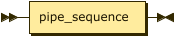
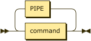
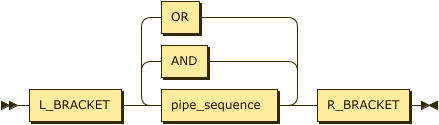
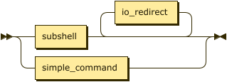
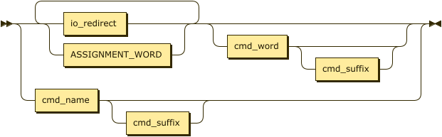
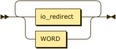
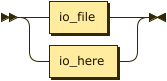
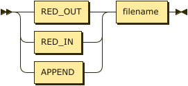
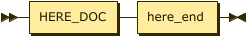
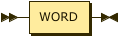

**start:**



```
start    ::= pipe_sequence
```

**pipe_sequence:**



```
pipe_sequence
         ::= command ( PIPE command )*
```

referenced by:

* start
* subshell

**subshell:**



```
subshell ::= L_PAREN pipe_sequence ( ( AND | OR ) pipe_sequence )* R_PAREN
```

referenced by:

* command

**command:**



```
command  ::= simple_command
           | subshell io_redirect*
```

referenced by:

* pipe_sequence

**simple_command:**



```
simple_command
         ::= ( io_redirect | ASSIGNMENT_WORD )+ ( cmd_word cmd_suffix? )?
           | cmd_name cmd_suffix?
```

referenced by:

* command

**cmd_name:**


```
cmd_name ::= WORD
```

referenced by:

* simple_command

**cmd_word:**


```
cmd_word ::= WORD
```

referenced by:

* simple_command

**cmd_suffix:**



```
cmd_suffix
         ::= ( io_redirect | WORD )+
```

referenced by:

* simple_command

**io_redirect:**



```
io_redirect
         ::= io_file
           | io_here
```

referenced by:

* cmd_suffix
* command
* simple_command

**io_file:**



```
io_file  ::= ( RED_OUT | RED_IN | APPEND ) filename
```

referenced by:

* io_redirect

**filename:**


```
filename ::= WORD
```

referenced by:

* io_file

**io_here:**



```
io_here  ::= HERE_DOC here_end
```

referenced by:

* io_redirect

**here_end:**



```
here_end ::= WORD
```

referenced by:

* io_here

##
 <sup>generated by [RR - Railroad Diagram Generator][RR]</sup>

[RR]: http://bottlecaps.de/rr/ui
